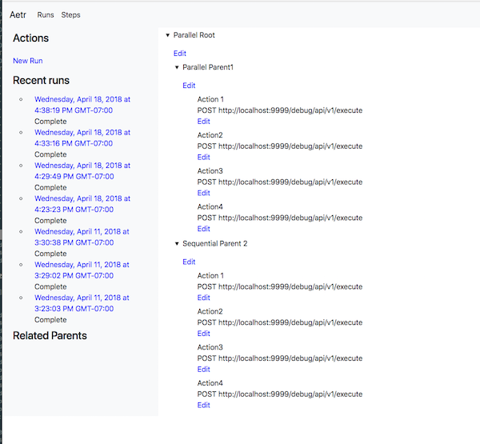
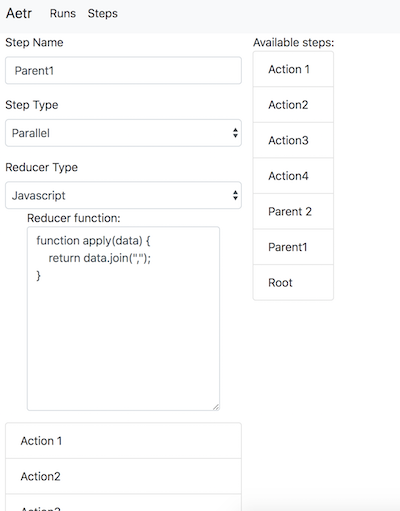
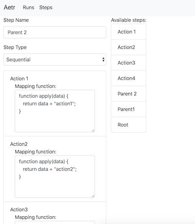
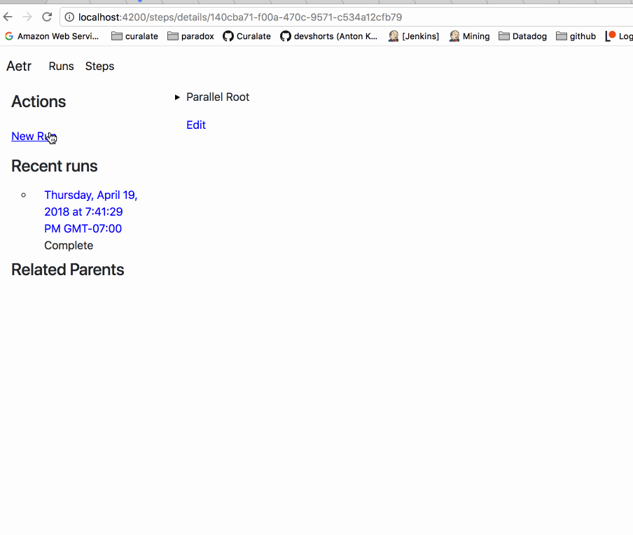

Aetr
===

[](https://travis-ci.org/paradoxical-io/aetr)


AETR is an *A*PI *E*xecution *T*ask *R*unner.  Basically its there to manage a workflow of calling API's in a particular step for you.

Get at it on [dockerhub](https://hub.docker.com/r/paradoxical/aetr)

```
docker pull paradoxical/aetr
```

What is AETR?
---

Lots of workflows are already separated by logical API's and the coordination of calling this, then that, is easy in a scenario where a single workflow is being consumed.

However, if you start wanting to create composable pieces of workflows then it becomes trickier.

AETR lets you create composable trees of workflows and acts a centralized manager for the results of these workflows as well as the coordination of their execution.

AETR can execute trees in parallel or in sequence, and it can map data from one step to another (and reduce results from parallel steps).

Think of aetr as like a very simplified version of amazon workflow, where it's optimized to only execute POST calls on already existing API's that you manage.


Demo
--
Lets look a a tree:



We can see that the root node says to run its branches in parallel, and that the first branch is also parallel with a bunch of API actions. And the second branch is sequential with a bunch of API actions.

Paralell nodes can run... in parallel! Which means that once they are in an executing state they will all be fired off at the same time. 

Sequential nodes must run in order. Each node must wait for its previous node to complete before being able to complete.

Digging more into parallel nodes, lets see what the parent looks like:



We can see here that the parallel parent has defined a `reducer`, which is a way of taking the results of all its children and making 1 result from it.  This result can be passed to the next node! In the example we have here, all of the results of the children will be joined together.  AETR provides a defaul reducer of `last` in case you want to take the last child's (not necessarily the last one to finish!) result.

AETR lets you write standard javascript to format the results of reducers, as long as the function returns a _string_. This means if you want to return something structured like JSON or XML to the next node, you must return it back as a string to aetr (via `JSON.stringify(...)` for example).

Lets look at the sequential node:



Here we can see something different. Unlike the parallel node, there is no reducer, and instead each child has an optional `mapper`. A mapper transforms the results from one node to the next.  You can see that `Action 1` is set up to map whatever data is returned from the action and to append the word `action` to its result. `Action 2` does the same thing, but with the word `action2`, etc.  The _input_ to `action1` is the _input_ to its parent. And the input to its parent is going to be whatever the input is of the root, which will be user specified. 

The final result of a sequentual node is the _last_ child in the tree.  This makes sense because all the previous items are just there as intermediate steps. The result of the last node becomes the result of the entire branch.

Let's put it all into action:



In this demo we start a run from a set of steps and give the initial node the input `hello world!`. You can see that the input is passed to all the child nodes, where the parallel branches run at the same time, and sequential branches block until the previous is done.

Clicking on each node in the branch shows its results (with the optional mapper or reducer applied)!

Getting Started
---

AETR can run async steps as a workflow.  To start, a postgres DB is required. Run `create-db` to initialize the datastore.

## Data Model
The data model is represented by two concepts

1. StepTree
2. Run

### StepTree

A step tree is a template of what to do. It is the workflow.  Step trees are composed of 3 options, either a parent node which has children to be run in 
either sequential or parallel mode, or a child node which is an action.

Currently supported actions are executing POST requests on an API URL.  

URL's POSTed to should response back to the completion API with the passed in RunToken.

### Run

A run is an instance of a step tree. It is a distinct workflow.  Run's store the result of each node and parent nodes determine their results from children.

### POST Format

Endpoints URLs are always POST'd to and include a url query param of the form:

`aetr=<callback-url>`

Consumers of AETR should POST back to the callback URL along with any response data they want to send. Response data is processed as raw strings on AETR's side, and will be passed along to any downstream nodes or stored as the tree result.

Development
---

Run `docker-compose up`

If this is your first time, create the db via:

```
docker run \
    -e DB_JDBC_URL=jdbc:postgresql://db:5432/aetr \
    --network aetr_default \
    paradoxical/aetr:1.0-SNAPSHOT create-db```

```

From then you can now run the server:

```
docker run -it -p 9999:9999 \
  -e DB_JDBC_URL=jdbc:postgresql://db:5432/aetr \
  --network aetr_default \
  paradoxical/aetr:1.0-SNAPSHOT server
```

